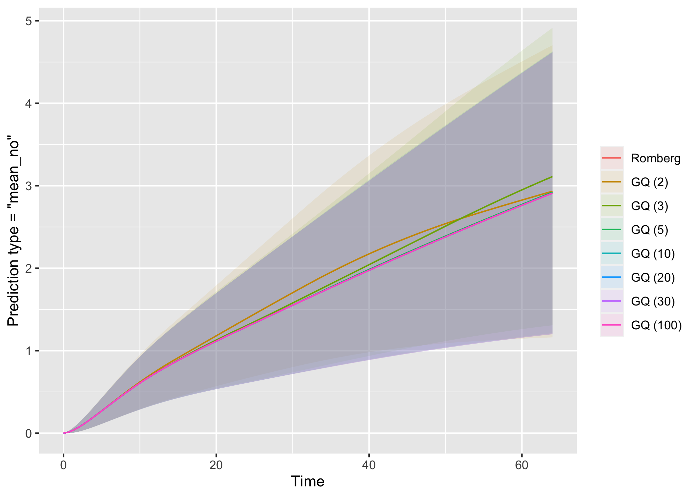
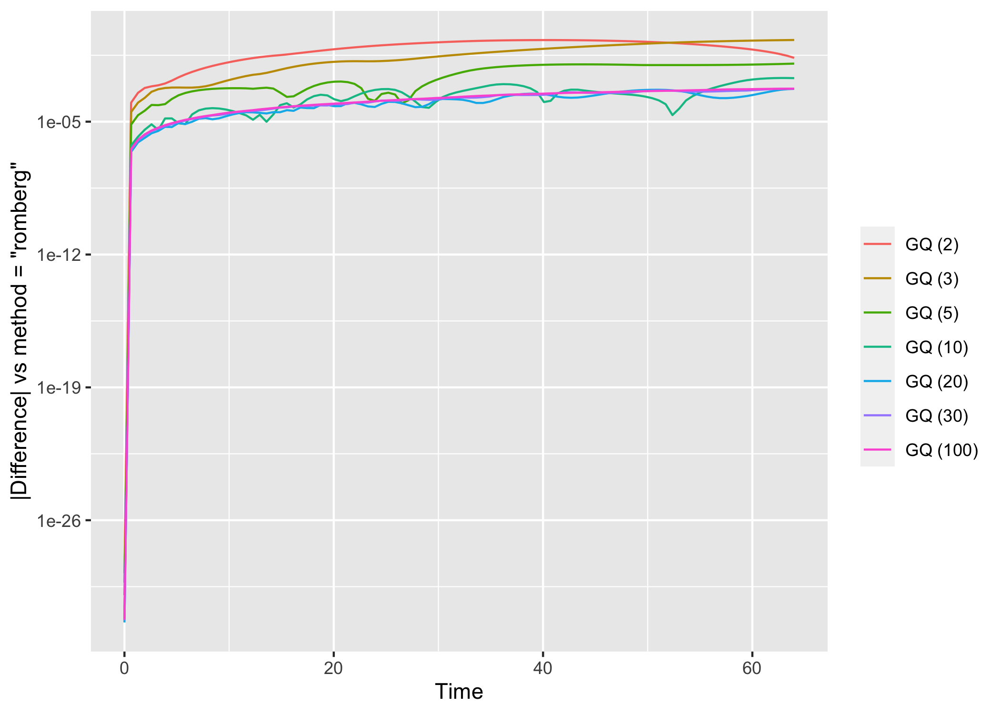
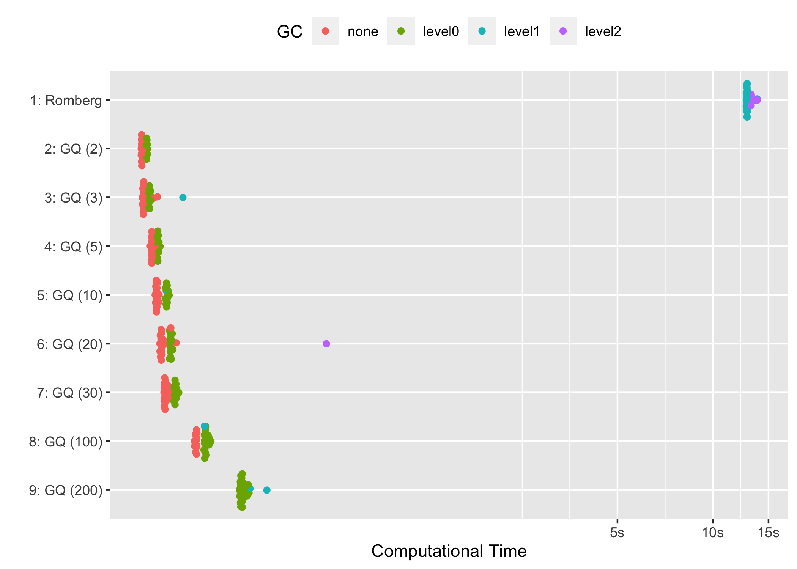
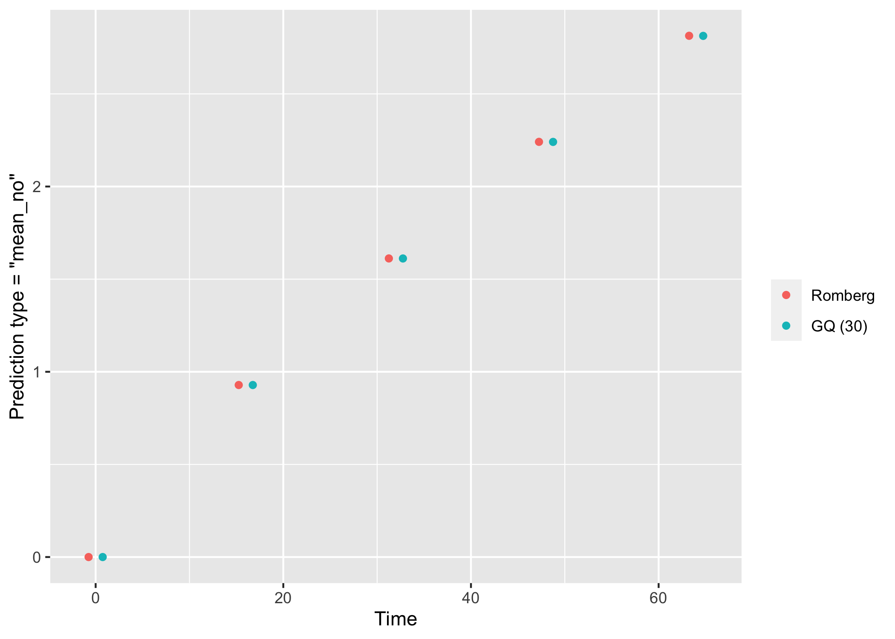
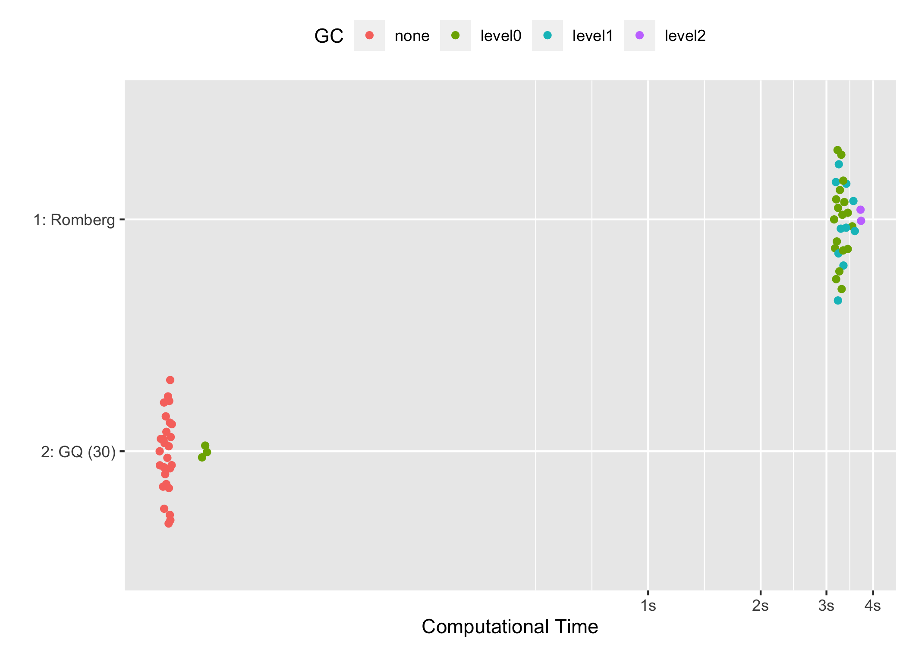

# Numerical Integration: Romberg vs Gaussian Quadrature
Alessandro Gasparini, <alessandro.gasparini@reddooranalytics.se>

This document replicates the example from the README file comparing the
different options for numerical integration, both in terms of accuracy
and computational time. These are discussed in
[Section 1](#sec-accuracy) and [Section 2](#sec-benchmark),
respectively.

We start by replicating the example from the README file:

``` r
library(tidyverse)
```

    ── Attaching core tidyverse packages ──────────────────────── tidyverse 2.0.0 ──
    ✔ dplyr     1.1.4     ✔ readr     2.1.5
    ✔ forcats   1.0.0     ✔ stringr   1.5.1
    ✔ ggplot2   3.4.4     ✔ tibble    3.2.1
    ✔ lubridate 1.9.3     ✔ tidyr     1.3.0
    ✔ purrr     1.0.2     
    ── Conflicts ────────────────────────────────────────── tidyverse_conflicts() ──
    ✖ dplyr::filter() masks stats::filter()
    ✖ dplyr::lag()    masks stats::lag()
    ℹ Use the conflicted package (<http://conflicted.r-lib.org/>) to force all conflicts to become errors

``` r
library(JointFPM)
library(data.table)
```


    Attaching package: 'data.table'

    The following objects are masked from 'package:lubridate':

        hour, isoweek, mday, minute, month, quarter, second, wday, week,
        yday, year

    The following objects are masked from 'package:dplyr':

        between, first, last

    The following object is masked from 'package:purrr':

        transpose

``` r
bldr_df <- as.data.table(survival::bladder1)
bldr_df <- bldr_df[, .(id, treatment, start, stop, status)]
bldr_ce <- bldr_df[, .SD[stop == max(stop)],
  by = id
]
bldr_ce[, `:=`(
  ce = 1,
  re = 0,
  event = as.numeric(status %in% 2:3),
  start = 0
)]
bldr_re <- bldr_df[
  ,
  `:=`(
    ce = 0,
    re = 1,
    event = as.numeric(status == 1)
  )
]
bldr_stacked <- rbindlist(list(bldr_ce, bldr_re))
bldr_stacked[, `:=`(
  pyridoxine = as.numeric(treatment == "pyridoxine"),
  thiotepa = as.numeric(treatment == "thiotepa")
)]
bldr_stacked$stop[bldr_stacked$stop == 0] <- 1 # Add one day survival

bldr_model <- JointFPM(
  Surv(
    time = start,
    time2 = stop,
    event = event,
    type = "counting"
  ) ~ 1,
  re_model = ~ pyridoxine + thiotepa,
  ce_model = ~ pyridoxine + thiotepa,
  re_indicator = "re",
  ce_indicator = "ce",
  df_ce = 3,
  df_re = 3,
  tvc_ce_terms = list(
    pyridoxine = 2,
    thiotepa = 2
  ),
  tvc_re_terms = list(
    pyridoxine = 2,
    thiotepa = 2
  ),
  cluster = "id",
  data = bldr_stacked
)
```

# Accuracy

We compute predictions for the mean number of events at the following
time points:

``` r
timep <- seq(.Machine$double.eps, max(bldr_stacked$stop), length.out = 100)
```

…and for the following covariates profile:

``` r
nd <- data.frame(pyridoxine = 1, thiotepa = 0)
```

We start with Romberg integration (the default), which automatically
iterates until convergence:

``` r
p_r <- predict(bldr_model, newdata = nd, t = timep, method = "romberg") |>
  mutate(method = "romberg")
```

Then, we use Gauss-Hermite quadrature with 2, 3, 5, 10, 20, 30, or 100
quadrature points:

``` r
library(glue)

p_gq <- map_dfr(
  .x = c(2, 3, 5, 10, 20, 30, 100),
  .f = function(x) {
    predict(bldr_model, newdata = nd, t = timep, method = "gq", ngq = x) |>
      mutate(method = glue("gq{x}"))
  }
)
```

We combine these predictions and plot them:

``` r
bind_rows(p_r, p_gq) |>
  mutate(method = factor(
    x = method,
    levels = c("romberg", "gq2", "gq3", "gq5", "gq10", "gq20", "gq30", "gq100"),
    labels = c("Romberg", "GQ (2)", "GQ (3)", "GQ (5)", "GQ (10)", "GQ (20)", "GQ (30)", "GQ (100)")
  )) |>
  ggplot(aes(x = stop, y = fit)) +
  geom_ribbon(aes(ymin = lci, ymax = uci, fill = method), alpha = 0.1) +
  geom_line(aes(color = method)) +
  labs(x = "Time", y = 'Prediction type = "mean_no"', color = "", fill = "")
```



We can also compute differences with the default setting
`method = "romberg"` (with plot on the log10 scale):

``` r
bind_rows(p_r, p_gq) |>
  select(stop, fit, method) |>
  pivot_wider(names_from = "method", values_from = "fit") |>
  pivot_longer(-c("stop", "romberg")) |>
  mutate(diff = abs(value - romberg)) |>
  mutate(name = factor(
    x = name,
    levels = c("gq2", "gq3", "gq5", "gq10", "gq20", "gq30", "gq100"),
    labels = c("GQ (2)", "GQ (3)", "GQ (5)", "GQ (10)", "GQ (20)", "GQ (30)", "GQ (100)")
  )) |>
  ggplot(aes(x = stop, y = diff, color = name)) +
  geom_line() +
  scale_y_log10() +
  labs(x = "Time", y = '|Difference| vs method = "romberg"', color = "")
```



Once we use 20+ integration points, the predicted values are pretty
close to each other. With 30+ integration points the two methods
(Romberg vs Gaussian quadrature) are largely perfectly overlapping.

# Benchmark

We compare the different integration techniques using the {bench}
package; we already tested comparative accuracy of the different methods
in [Section 1](#sec-accuracy), thus we do not check that here, only
performance. Note that we use a reduced number of time points here,
`timep2`, to reduce the overall computational time, and we repeat each
function call `iteration = 30` times:

``` r
library(bench)

timep2 <- seq(.Machine$double.eps, max(bldr_stacked$stop), length.out = 5)

perf <- mark(
  "01: Romberg" = predict(bldr_model, newdata = nd, t = timep2, method = "romberg"),
  "02: GQ (2)" = predict(bldr_model, newdata = nd, t = timep2, method = "gq", ngq = 2),
  "03: GQ (3)" = predict(bldr_model, newdata = nd, t = timep2, method = "gq", ngq = 3),
  "05: GQ (5)" = predict(bldr_model, newdata = nd, t = timep2, method = "gq", ngq = 5),
  "06: GQ (10)" = predict(bldr_model, newdata = nd, t = timep2, method = "gq", ngq = 10),
  "08: GQ (20)" = predict(bldr_model, newdata = nd, t = timep2, method = "gq", ngq = 20),
  "10: GQ (30)" = predict(bldr_model, newdata = nd, t = timep2, method = "gq", ngq = 30),
  "11: GQ (100)" = predict(bldr_model, newdata = nd, t = timep2, method = "gq", ngq = 100),
  check = FALSE, iterations = 30
)
```

    Warning: Some expressions had a GC in every iteration; so filtering is
    disabled.

``` r
summary(perf)
```

    Warning: Some expressions had a GC in every iteration; so filtering is
    disabled.

    # A tibble: 8 × 6
      expression        min   median `itr/sec` mem_alloc `gc/sec`
      <bch:expr>   <bch:tm> <bch:tm>     <dbl> <bch:byt>    <dbl>
    1 01: Romberg     12.9s    13.2s    0.0749  185.57MB     2.58
    2 02: GQ (2)    156.1ms  160.8ms    6.11      4.27MB     2.44
    3 03: GQ (3)    160.8ms  169.1ms    5.90      6.81MB     2.36
    4 05: GQ (5)    171.4ms  178.6ms    5.54     10.76MB     2.40
    5 06: GQ (10)     176ms  184.9ms    5.27     23.23MB     2.28
    6 08: GQ (20)   180.3ms  187.4ms    5.28     44.66MB     2.29
    7 10: GQ (30)   182.8ms  189.8ms    4.84     65.89MB     2.10
    8 11: GQ (100)  248.6ms  258.2ms    3.84    213.99MB     3.58

…or, on a relative scale (vs the fastest time):

``` r
summary(perf, relative = TRUE)
```

    Warning: Some expressions had a GC in every iteration; so filtering is
    disabled.

    # A tibble: 8 × 6
      expression     min median `itr/sec` mem_alloc `gc/sec`
      <bch:expr>   <dbl>  <dbl>     <dbl>     <dbl>    <dbl>
    1 01: Romberg  82.5   82.0        1       43.5      1.23
    2 02: GQ (2)    1      1         81.5      1        1.16
    3 03: GQ (3)    1.03   1.05      78.8      1.60     1.13
    4 05: GQ (5)    1.10   1.11      74.0      2.52     1.14
    5 06: GQ (10)   1.13   1.15      70.4      5.44     1.09
    6 08: GQ (20)   1.15   1.17      70.6     10.5      1.09
    7 10: GQ (30)   1.17   1.18      64.7     15.4      1   
    8 11: GQ (100)  1.59   1.61      51.2     50.1      1.71

The predictions calculated using Gaussian quadrature are significantly
faster than the predictions that use Romberg integration, but with
comparable accuracy (as long as 30+ integration points are used).

Finally, we can plot the different timings:

``` r
library(ggbeeswarm)

autoplot(perf) +
  scale_x_discrete(limits = rev) +
  labs(x = "", y = "Computational Time", color = "GC") +
  theme(legend.position = "top")
```



# Standardisation

Finally, let’s compare the computational cost of standardisation under
the different numerical integration strategies.

We start by adding two random covariates to the model, `X1` and `X2`:

``` r
set.seed(233497821)
new_covs <- distinct(bldr_stacked, id)
new_covs$X1 <- round(rnorm(n = nrow(new_covs)))
new_covs$X2 <- rbinom(n = nrow(new_covs), size = 1, prob = 0.3)
bldr_stacked <- left_join(bldr_stacked, new_covs, by = "id")
```

This corresponds to 9 distinct covariate profiles to standardise over:

``` r
distinct(new_covs, X1, X2)
```

       X1 X2
    1:  0  0
    2:  1  1
    3: -1  0
    4:  0  1
    5: -1  1
    6:  1  0
    7: -2  0
    8:  2  0
    9: -2  1

Then, we re-fit this model adding these two covariates to both the
recurring and competing events processes:

``` r
bldr_model_std <- JointFPM(
  Surv(
    time = start,
    time2 = stop,
    event = event,
    type = "counting"
  ) ~ 1,
  re_model = ~ pyridoxine + thiotepa + X1 + X2,
  ce_model = ~ pyridoxine + thiotepa + X1 + X2,
  re_indicator = "re",
  ce_indicator = "ce",
  df_ce = 3,
  df_re = 3,
  tvc_ce_terms = list(
    pyridoxine = 2,
    thiotepa = 2
  ),
  tvc_re_terms = list(
    pyridoxine = 2,
    thiotepa = 2
  ),
  cluster = "id",
  data = bldr_stacked
)
```

Finally, we compare Romberg integration and Gaussian quadrature with 30
points. Note that we do not compute confidence intervals here, to save
some time:

``` r
p_std_r <- predict(bldr_model_std, newdata = nd, t = timep2, type = "marg_mean_no", method = "romberg", ci_fit = FALSE) |>
  mutate(method = "romberg")
p_std_gq30 <- predict(bldr_model_std, newdata = nd, t = timep2, type = "marg_mean_no", method = "gq", ngq = 30, ci_fit = FALSE) |>
  mutate(method = "gq30")
bind_rows(p_std_r, p_std_gq30) |>
  mutate(method = factor(method, levels = c("romberg", "gq30"), labels = c("Romberg", "GQ (30)"))) |>
  ggplot(aes(x = stop, y = fit, color = method)) +
  geom_point(position = position_dodge(width = 3)) +
  labs(x = "Time", y = 'Prediction type = "mean_no"', color = "", fill = "")
```



Predictions are about the same:

``` r
library(knitr)

bind_rows(p_std_r, p_std_gq30) |>
  mutate(method = factor(method, levels = c("romberg", "gq30"), labels = c("Romberg", "GQ (30)"))) |>
  pivot_wider(names_from = "method", values_from = "fit") |>
  rename(Time = stop) |>
  kable()
```

| Time |   Romberg |   GQ (30) |
|-----:|----------:|----------:|
|    0 | 0.0000000 | 0.0000000 |
|   16 | 0.9286088 | 0.9285476 |
|   32 | 1.6117992 | 1.6116140 |
|   48 | 2.2411602 | 2.2408325 |
|   64 | 2.8136562 | 2.8131203 |

…but most importantly, Gaussian quadrature is significantly faster
(without accounting for additional savings when computing confidence
intervals):

``` r
perf_std <- mark(
  "1: Romberg" = predict(bldr_model_std, newdata = nd, t = timep2, type = "marg_mean_no", method = "romberg", ci_fit = FALSE),
  "2: GQ (30)" = predict(bldr_model_std, newdata = nd, t = timep2, type = "marg_mean_no", method = "gq", ngq = 30, ci_fit = FALSE),
  check = FALSE, iterations = 30
)
```

    Warning: Some expressions had a GC in every iteration; so filtering is
    disabled.

``` r
summary(perf_std, relative = TRUE)
```

    Warning: Some expressions had a GC in every iteration; so filtering is
    disabled.

    # A tibble: 2 × 6
      expression   min median `itr/sec` mem_alloc `gc/sec`
      <bch:expr> <dbl>  <dbl>     <dbl>     <dbl>    <dbl>
    1 1: Romberg  63.8   63.3       1        4.36     1.36
    2 2: GQ (30)   1      1        63.0      1        1   

``` r
autoplot(perf_std) +
  scale_x_discrete(limits = rev) +
  labs(x = "", y = "Computational Time", color = "GC") +
  theme(legend.position = "top")
```



Anecdotally, the relative performance of Gaussian quadrature compared to
Romberg integration should be even better when computing confidence
intervals and standardising over a larger number of covariate profiles.

# Session Info

``` r
library(sessioninfo)
sessioninfo::platform_info()
```

     setting  value
     version  R version 4.3.2 (2023-10-31)
     os       macOS Sonoma 14.2.1
     system   aarch64, darwin20
     ui       X11
     language (EN)
     collate  en_US.UTF-8
     ctype    en_US.UTF-8
     tz       Europe/Stockholm
     date     2024-01-18
     pandoc   3.1.1 @ /Applications/RStudio.app/Contents/Resources/app/quarto/bin/tools/ (via rmarkdown)
